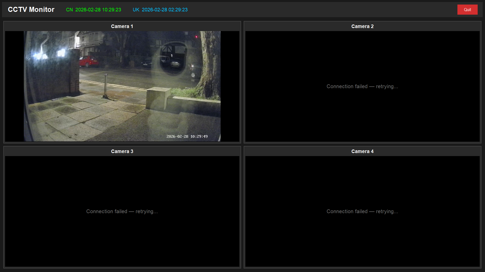
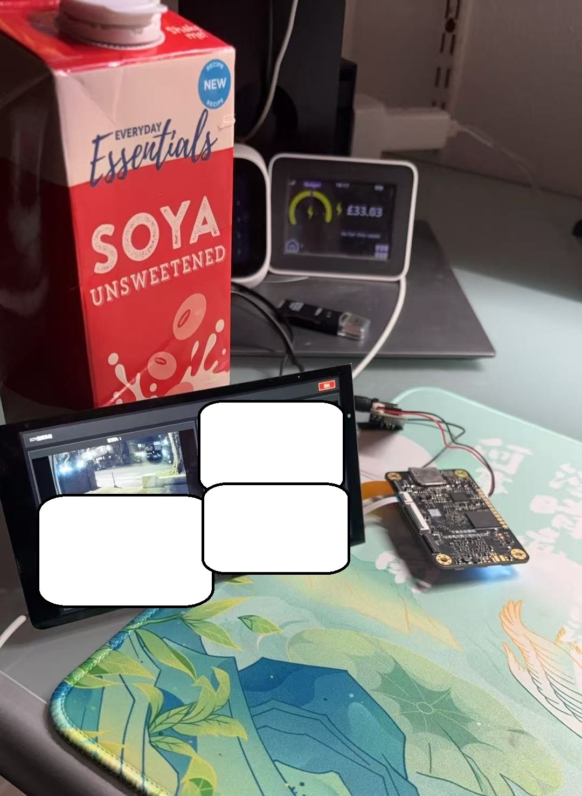

# CCTV Monitor

A full-screen Python GUI application that previews up to **4 RTSP video streams** simultaneously in a 2×2 grid.  
Designed and optimised for the **TSPI RK3566** board (TaishanPi), but runs on any platform that supports Python 3.7+.

---

## Features

| Feature | Detail |
|---------|--------|
| Full-screen 2×2 grid | 4 camera panels, letterboxed aspect ratio |
| Dual-timezone clock | China time (green) + UK time (blue), top-left of title bar |
| Auto-reconnect | Detects stream loss and reconnects automatically |
| Hardware decode | CUDA · OpenCL/Mali · **MPP (RK3566)** · VAAPI · DXVA |

---

## Screenshots

| 4-channel grid view | Connection / status overlay |
|--------------------|-----------------------------|
|  |  |

> Screenshots taken on a TSPI RK3566 (TaishanPi) running Debian.

---

## Hardware Acceleration

The application detects and uses the best available backend at runtime:

| Platform | Backend | CPU reduction |
|----------|---------|--------------|
| NVIDIA GPU | CUDA | 60–80 % |
| RK3566 (TaishanPi) | **MPP** | 70–85 % |
| Mali GPU | OpenCL | 40–60 % |
| Intel GPU / Linux | VAAPI | 40–60 % |
| Windows | DXVA | 40–60 % |

### RK3566 / MPP notes

- **GPU (Mali G52)** handles image scaling and rendering via OpenCL (`cv2.UMat`).  
- **MPP** (Media Process Platform) handles H.264/H.265 video decoding in dedicated hardware.  
- **NPU is not required** — this project does no AI inference.  
- MPP is activated automatically when `/dev/mpp_service` is present or the device tree reports `rk3566`.

---

## Requirements

- Python 3.7+
- A graphical display (X11 / Wayland / Windows desktop)
- Recommended RAM: 1 GB+ (ARM), 2 GB+ (desktop)

---

## Installation

### Desktop (Windows / Linux / macOS)

```bash
git clone https://github.com/nickfu/tspi_CCTV.git
cd tspi_CCTV
pip install -r requirements.txt
python cctv_monitor.py
```

On Windows you can also double-click **`run.bat`**.

### ARM device (TaishanPi / Raspberry Pi / Orange Pi)

**On your Windows PC:**

```bat
package_for_arm.bat
```

This creates `cctv_monitor_arm.zip`.  Transfer it to the ARM device, then:

```bash
unzip cctv_monitor_arm.zip
cd cctv_monitor_arm_deploy
sudo bash install_arm.sh
```

**Optional — run on boot:**

```bash
sudo bash systemd_service.sh
sudo systemctl start cctv-monitor
```

---

## Configuration

Edit `cctv_monitor.py` and update the `video_sources` list:

```python
self.video_sources = [
    "rtsp://192.168.1.100/stream1",   # Camera 1
    "rtsp://192.168.1.101/stream1",   # Camera 2
    "rtsp://192.168.1.102/stream1",   # Camera 3
    "rtsp://192.168.1.103/stream1",   # Camera 4
]
```

Set a source to `None` to leave that slot empty.

Auto-reconnect settings (also in `__init__`):

```python
self.reconnect_delay = 3   # seconds between reconnect attempts
self.frame_timeout   = 10  # seconds without a frame = stream lost
```

---

## Keyboard shortcuts

| Key | Action |
|-----|--------|
| `ESC` | Exit fullscreen |
| `F11` | Toggle fullscreen |
| Quit button | Close application |

---

## Troubleshooting

**No video / black screen**  
→ Verify the RTSP URL with VLC or `ffplay`.  
→ Check network connectivity and firewall rules.

**High CPU usage**  
→ Confirm hardware acceleration is active in the startup log (`HW Type: mpp`).  
→ Lower the source resolution on the camera.

**MPP not detected on RK3566**  
→ Check `/dev/mpp_service` exists (`ls -l /dev/mpp_service`).  
→ Check the kernel module: `lsmod | grep mpp`.  
→ Install the Rockchip MPP library: `apt-get install librockchip-mpp1`.

---

## Project files

```
cctv_monitor.py        Main application
requirements.txt       Python dependencies (desktop)
requirements_arm.txt   Python dependencies (ARM)
install_arm.sh         ARM installer script
systemd_service.sh     systemd auto-start setup
package_for_arm.bat    Windows helper to create ARM deploy package
run.bat                Windows quick-launch script
setup.py               pip / PyInstaller package config
README.md              This file
demo/pic1.png          Screenshot — 4-channel grid view
demo/pic2.jpg          Screenshot — connection/status overlay
```

---

## Tech stack

- **Tkinter** — GUI framework  
- **OpenCV** — video capture and hardware-accelerated resize  
- **Pillow** — image conversion for Tkinter display  
- **pytz** — timezone handling  
- **threading** — per-camera background capture threads  

---

## Licence

MIT
